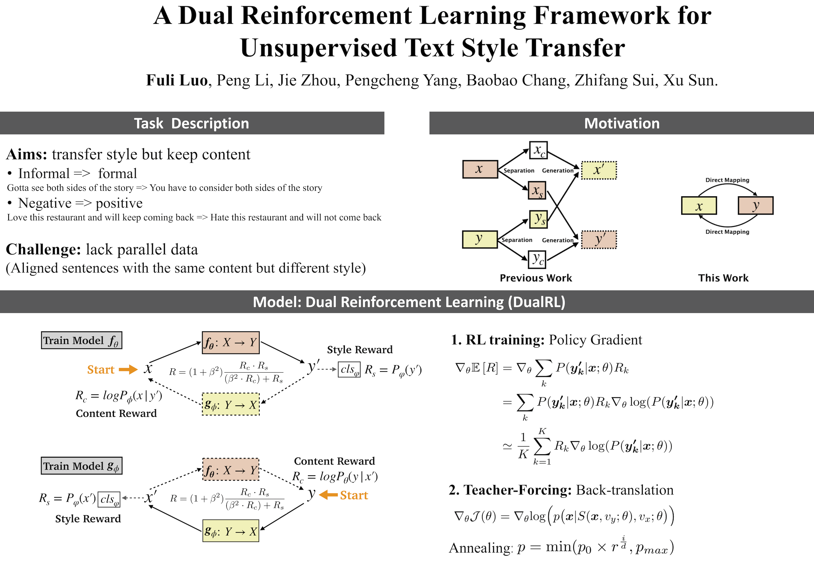

# [A Dual Reinforcement Learning Framework for Unsupervised Text Style Transfer (IJCAI 2019)](https://export.arxiv.org/pdf/1905.10060)
<p align="center"></p>

## Reproducibility
**In order to help you quickly reproduce the existing works of text style transfer, we release the outputs of all models and the corresponding references.**

- **Outputs**: Generated results (outputs) of **10 baselines** and **our model** are in the `outputs/` directory.
- **References**: Human references are in the `references/` directory. We also release the three more references we collected on the yelp test dataset, namely `reference[0,1,2,3].0`(the transferred references of negative sentences) and `reference[0,1,2,3].1` (the transferred references of positive sentences). The `reference0.0` and `reference0.1` are collected by [Li et al., 2018](https://github.com/shentianxiao/language-style-transfer). We **strongly recommend** that you use the released multi-references dataset because it has a stronger correlation with human evaluation results.

*Ps: We welcome other researchers pull request the outputs of your models.*

## Dataset
### [yelp](https://www.yelp.com/dataset/challenge): negative sentiment (0) <--> positive sentiment (1)
- **Original dataset**:
The original yelp dataset is in the `data/yelp` directory, where `x.0` denotes the negative `x` type of data and `x.1` denotes the positive `x` type of data. `x` is in `[train, dev, test]`.
- **Pseudo-parallel data:**
The pseudo-parallel data generated by templates can be found in the `data/yelp/tsf_template` directory. `x.0.tsf` denotes the negative transferred file in which each line only has the sentiment transferred sentence, while `x.0-1.tsf` denotes the negative transferred file in which each line has both the original sentence (input) and sentiment transferred sentence (output).

### [GYAFC](https://github.com/raosudha89/GYAFC-corpus): informal text (0) <--> formal text (1)
Since the GYAFC dataset is only free of charge for research purposes, we only publish a subset of the test dataset in the family and relationships domain (`data/GYAFC/`), the outputs (`outputs/GYAFC/`) of each system (including our model and all baselines) and the corresponding human references (`references/GYAFC/`). If you want to download the train and validation dataset, please follow the guidance at [https://github.com/raosudha89/GYAFC-corpus](https://github.com/raosudha89/GYAFC-corpus). And then, name the corpora of two styles as the yelp dataset.

## Quick Start
First of all, you should specify the dataset.
For example, for yelp dataset:
```
export DATASET=yelp
```
If you want to use your own datasets, please follow the guidance of next section [Extend to other tasks and datasets](#extend-to-other-tasks-and-datasets).

### Step 1: Pre-train classifier
```
cd classifier
python textcnn.py --mode train
```
**Note:** If you get the error `no module named opennmt`, please install `OpenNMT-tf`: `pip install OpenNMT-tf==1.15.0`.

### Step 2: Pre-train two seq2seq (nmt) models using pseudo-parallel data
#### 2.1 Prepare pseudo-parallel data 
To generate pseudo-parallel data, we follow the [template-based method](https://github.com/shentianxiao/language-style-transfer) proposed by [Li et al., 2018](https://aclweb.org/anthology/N18-1169). And we have provided the pseudo-parallel data of the yelp dataset in the `data/yelp/tsf_template` directory. However, if you want to generate the pseudo-parallel data using templates, you can follow [this link](https://github.com/lijuncen/Sentiment-and-Style-Transfer/issues/6) or design your own templates which are suitable for your task and dataset.

#### 2.2 Pre-train two seq2seq (nmt) models 
The default encoder and decoder are **bilstm**.
```
cd nmt
python nmt.py --mode train --nmt_direction 0-1 --n_epoch 5  # Pre-train forward (f) model
python nmt.py --mode train --nmt_direction 1-0 --n_epoch 5  # Pre-train backward (g) model
```

If you want to adopt **transformer** as encoder and decoder, run the following code:
```
cd nmt
python nmt.py --mode train --nmt_direction 0-1 --n_epoch 5 --n_layer 6 --encoder_decoder_type transformer
python nmt.py --mode train --nmt_direction 1-0 --n_epoch 5 --n_layer 6 --encoder_decoder_type transformer 
```

### Step 3: Dual reinforcement learning
```
python dual_training.py --n_epoch 10
```
The final transffered results are in the `../tmp/output/${DATASET}_final/` dir.

## Extend to other tasks and datasets
If you don't have parallel or paired data, here are the processes you might go through:
1. Prepare two unaligned (unpaired) corpora, one sentence per line
2. Divide the dataset into train/dev/test
3. Prepare pseudo-parallel corpus, you can use [Li's](https://github.com/lijuncen/Sentiment-and-Style-Transfer/issues/6) method, or your own designed heuristic rules/templates
4. Run step 1-3 in the section of [Quick Start](#quick-start) and specify the path to your new dataset or rename them like files in `data/yelp/` and `references/yelp/`.

If you have parallel or paired data, here are the processes you might go through:
1. Prepare two parallel corpora, one sentence per line
2. Divide the dataset into train/dev/test
3. Copy the dataset generated in the second step as the "pseudo-parallel" corpus to `data/yelp/tsf_template`
4. Run step 1-3 in the section of [Quick Start](#quick-start) and specify the path to your new dataset or rename them like files in `data/yelp/` and `references/yelp/`.

*You can run the following code to see which parameters need to be set*
```
python [dual_training.py | nmt.py | textcnn.py] --help
```

## FAQ
### About pseudo-parallel data
For some tasks, [Li's](https://github.com/lijuncen/Sentiment-and-Style-Transfer/issues/6) method can't be used to generate pseudo-parallel data. Here are some related frequently asked questions:

1. [Can I use the original sentence to pre-train the two seq2seq models?](https://github.com/luofuli/DualRL/issues/4)

You can refer to [this issue](https://github.com/luofuli/DualRL/issues/4) to generate pseudo-parallel data via simply add some noise to the original sentence.

2. Can I use other style transfer models to generate pseudo-parallel data?

Of course, you can! Actually, we have tried to use [CrossAlignment(Shen et al.,)](https://github.com/shentianxiao/language-style-transfer) to generated pseudo-parallel data. However, the experimental results are worse than using template-based methods.

3. How about using several different methods to construct pseudo-parallel data? 

We have tried to merge pseudo-parallel data generated by [CrossAlignment (Shen et al.,)](https://github.com/shentianxiao/language-style-transfer) and [Template-based(Li et al.,)](https://github.com/lijuncen/Sentiment-and-Style-Transfer/issues/6) to pre-train our model. There is a slight improvement in the experimental results.

4. Can I train the model without pre-training with pseudo-parallel data?

This is an interesting question. I will try to remove the pre-training step. I think a feasible solution is to just initialize the word-embeddings of seq2seq (nmt) model, inspired by the [three principles of unsupervised machine translation](https://arxiv.org/pdf/1804.07755.pdf). 

#### Tips
**Note**: No matter what method you use to construct pseudo-parallel data, the style transferred sentence or generated sentence `y'` (lower quality) should be the input, not the output (ground truth). This is validated to be important by our experiments. And what you need to actually do is to put `y'\tx\n` into files of `tsf-template` dir.

## Dependencies
```
python==2.7
numpy==1.14.2
tensorflow==1.13.1
OpenNMT-tf==1.15.0 
```

## Cite

If you use this code, please cite the following paper:
```
@inproceedings{Luo19DualRL,
  author    = {Fuli Luo and
               Peng Li and
               Jie Zhou and
               Pengcheng Yang and
               Baobao Chang and
               Zhifang Sui and
               Xu Sun},
  title     = {A Dual Reinforcement Learning Framework for Unsupervised Text Style Transfer},
  booktitle = {Proceedings of the 28th International Joint Conference on Artificial Intelligence, {IJCAI} 2019},
  year      = {2019},            
}
```
